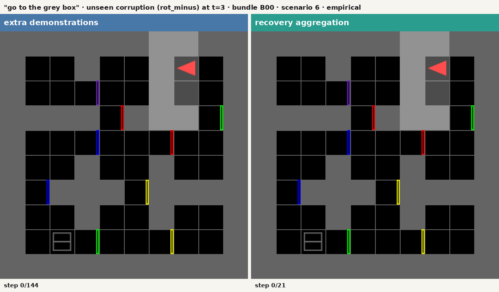

# Recovery Policy Learning / Grounded Recovery

Budget-matched corrective imitation learning for recovery in language-conditioned
embodied policies in BabyAI/MiniGrid.

## The question

A behavioral-cloning policy is trained from scripted-oracle demonstrations, then
granted a fixed budget of **B = 1,000 additional revealed oracle labels**. Under
matched supervised target exposure and identical optimization, is that budget
more useful spent on

- **recovery-state aggregation**: DAgger-style labels queried in states the
  learner actually visits after one corrupted action, or
- **extra nominal demonstrations**: more expert trajectories of the kind the
  base policy was already trained on?

The primary endpoint is **eligible unseen one-corruption intention-to-treat
success**: closed-loop task success when a *held-out* corruption operator, at a
disjoint set of scheduled times, replaces one policy proposal per episode on a
frozen, eligibility-filtered, never-touched test panel. The unchanged base
policy is a contextual baseline, not the primary competitor.

## What is held equal between the two full-budget arms

| matched exactly | logged, not matched |
| --- | --- |
| starting checkpoint (bit-identical clone of the shared base) | oracle calls: 38,109 for recovery against 6,000 for extra demonstrations |
| additional revealed oracle labels (B = 1,000; 250 per round × 4 rounds) | discarded oracle recommendations: 32,109 against 0 |
| optimizer updates (500 per round) and base:new targets per update (64:16) | simulator transitions, unique episodes, temporal correlation |
| context caps, BPTT rule, replay rule, loss, optimizer, clipping | wall-clock collection cost |
| fixed-final checkpoint rule (no method-specific selection) | |

Summed over the six bundles both arms saw exactly 768,000 base target
exposures, 192,000 new target exposures, and 12,000 optimizer updates.
Recovery labels cost roughly six times more oracle queries to acquire, and that
asymmetry is published rather than called equal. Every accounting row lives in
hash-chained ledgers; an independent recount refuses training when ledger and
data disagree.

## Result (confirmatory)

On the frozen eligible unseen panel (536 scenarios per cell, intention-to-treat,
six complete pipeline bundles, one receipted opening):

> **Recovery aggregation − extra demonstrations = +14.3 percentage points**
> (95% paired *t* interval **[+10.0, +18.6] pp**; SESOI +5 pp; all six
> per-bundle differences positive, range +10.1 to +21.5 pp; crossed cluster
> bootstrap sensitivity [+10.6, +18.4] pp; precision target met).

Mean ITT success over the six bundles:

| arm | clean | matched | unseen (primary) |
| --- | --- | --- | --- |
| BC base (no added labels) | 76.3% | 66.9% | 65.8% |
| extra demonstrations | 80.3% | 72.5% | 70.2% |
| recovery aggregation | **86.1%** | **85.7%** | **84.5%** |

Under the held-out corruption the base and extra-demonstration arms lose about
10 pp relative to their clean rates; the recovery arm loses 1.5 pp, and it also
leads on the clean slice by +5.8 pp [+3.7, +7.9], so the benefit is not
purchased with a clean performance loss. Scheduled corruptions were delivered
in at least 99.6% of assigned unseen episodes; undelivered assignments remain
in every denominator.

Reported beside the benefit, not below it: every failure in the study is a
step-limit timeout (there is no other termination category in this
environment); the recovery arm's *successful* episodes take a slightly longer
path relative to the oracle (median step ratio 1.324 against 1.250 for extra
demonstrations); and the extra-demonstration arm is not clearly separated from
the untouched base at six bundles (+4.5 pp [-0.7, +9.6]), so the base line
should not be read as a resolved comparison.

**What this does not establish.** The evidence is in silico, symbolic,
discrete, and oracle-supervised: no reinforcement learning, no physical robot,
no human teachers. On a three-action set exactly two corruption operators
exist, so "unseen" means the unique other derangement at disjoint scheduled
times, not an independently sampled family. Full scope boundary
[below](#what-this-experiment-does-not-establish).

### One scenario, both arms



Both policies face the identical world, mission, and corruption ("go to the
grey box", proposal replaced at t = 3 by the held-out operator). The
extra-demonstrations policy never recovers and hits the 144-step limit; the
recovery-aggregation policy reaches the goal. The left pane stops two seconds
after that policy stops moving, with the freeze step and the true step limit
printed on the frame and recorded in the manifest, so the clip stays short
while the outcome stays visible. The scenario was chosen by a disclosed
deterministic rule: the smallest eligible-unseen ordinal of the reference
bundle where recovery succeeded and extra demonstrations failed. A recovery-arm *failure* under the same rule family, and
an illustrative scripted-oracle rollout, are in
[`public_result/media/`](public_result/media/) with hashes and selection
rules in `media_manifest.json`; each animation deterministically replays an
actual evaluated episode and its outcome is asserted against the stored row.

Evidence trail: `results/e777efe2d8f8/` (opening receipt, 28,944 raw episode
rows, analysis, audits, figures, media) → `public_result/` (validated public
bundle) → `build/recovery-policy-learning-report.pdf` (technical report). The
release-phase integrity command re-derives the headline numbers from the raw
rows. Two scenario panels reserved at freeze time were opened afterwards as
clearly labelled exploratory extensions (`results/exploratory/`).
Validation-pilot evidence (tuning only): `data/pilot_reports/gpu_v1/`.

## The system in one paragraph

Environment: `BabyAI-GoToObjMazeS4-v0` (3×3 maze of 4×4 rooms, one distractor)
with `doors_open=true`; with closed doors the scripted oracle must emit
`toggle`, which would break the frozen three-action movement set; the doors-open
parameterization is the environment's own kwarg and is part of the contract.
Oracle: the MiniGrid `BabyAIBot`, wrapped so `replan(last_executed)` is called
exactly once per active simulator step (a 1,200-episode preflight shows 100%
recovery after forced corruptions for both operator families, gate at least
0.99). Perturbations: on a three-action set exactly two total derangements
exist, the two 3-cycles; one is the collection operator, the other (its
inverse) is the unseen operator, with disjoint scheduled-time sets. Policy: a
small language-conditioned recurrent network (channel embeddings → two
convolutions → projection; mission GRU; previous *executed* action embedding;
fusion; policy GRU; linear head; 179,507 parameters), trained with masked
behavioral cloning on one-target history windows. Statistics: per-bundle success on the
frozen panel, paired within-bundle contrasts, a prespecified 95% paired *t*
interval across six complete pipeline bundles, and a crossed two-way cluster
bootstrap as a labelled sensitivity analysis. SESOI: 0.05 absolute success.

## Reproduce

Prerequisites: `uv`, and a system `ffmpeg` (only for the rollout animations).

```bash
uv sync --frozen
uv run gr smoke          --config configs/pilot.yaml
uv run gr make-manifests --config configs/pilot.yaml
uv run gr preflight      --config configs/pilot.yaml
uv run gr freeze         --config configs/pilot.yaml
for b in B00 B01 B02 B03 B04 B05; do
  uv run gr run-bundle --contract configs/experiment_contract.yaml --bundle $b
done
uv run gr integrity      --contract configs/experiment_contract.yaml --phase preopen
uv run gr evaluate-final --contract configs/experiment_contract.yaml
uv run gr analyze        --contract configs/experiment_contract.yaml
uv run gr audit          --contract configs/experiment_contract.yaml   # descriptive audits
uv run grf study-extras                                                # exploratory panels
uv run gr integrity      --contract configs/experiment_contract.yaml --phase release
uv run gr media          --contract configs/experiment_contract.yaml   # rollout animations
uv run gr publish-result --contract configs/experiment_contract.yaml
uv run gr export-typst   --contract configs/experiment_contract.yaml
typst compile report/main.typ build/recovery-policy-learning-report.pdf
uv run pytest -m "not slow"   # fast suite; run -m slow separately
                              # tests marked gpu skip without a CUDA device
```

Everything is deterministic given the contract: named seeds are derived with
SHA-256 from `(root_seed, bundle_id, component)`, and repeated runs reproduce
model state digests bit-for-bit on the pinned device.

## Foundations track (Part II of the report)

The study is also built up from scratch as seven small, deterministic,
tested side-studies (`src/gr_foundations/`, exploratory; the confirmatory
evidence is only the frozen study above). Each answers one question and
bridges into the study; figures, tables, and a mini-report per lab land in
`foundations/`:

| lab | question answered | key artifact |
| --- | --- | --- |
| 01 world | What is BabyAI; what does the agent actually see and do? | observation anatomy, world census |
| 02 decision | What is a POMDP; why here; what would alternatives cost? | measured perceptual aliasing with conflicting oracle labels |
| 03 oracle | What is a policy, the oracle, an expert label? | policy spectrum; oracle falsification attempt |
| 04 learning | Is this reinforcement learning, and if not, what is it? | from-scratch Q-learning; first cloned policies |
| 05 architecture | What exactly is the model; does every piece earn its place? | generated shape walkthrough; five-way ablation |
| 06 shift | Why does cloning break; what are recovery labels? | corruption sweep; mini three-arm preview |
| 07 measurement | What is intention-to-treat; why budgets, pairing, freezing? | known-truth bias simulations; tamper demos |

```bash
uv run grf run all        # ~15 min total (GPU for training labs); grf list for status
uv run grf media          # rollout videos + scrubber trajectories for the website
uv run grf network-trace  # real weights/activations for the website's network view
```

Post-freeze note: the foundations package, the rollout-media generator and its
rendering accessor on `WorldSession`, the descriptive audits, the two
exploratory panels, and the website were all added after the confirmatory test
opening. No frozen protocol value, manifest, checkpoint, or result artifact was
modified. The shipped tree therefore does not reproduce the freeze-time code
digest; what verifies the result is that the published summary recomputes from
the immutable episode rows, which `gr integrity --phase release` checks and
anyone can rerun. Details are in the report's reproduction chapter.

## Website

`site/` holds a story-driven companion site: the confirmatory result as the
landing exhibit, plus the eight-chapter journey (world → POMDP → oracle →
learning → architecture → shift → measurement → study) with rollout videos, an
in-page trajectory scrubber, an animated four-part story of the drift problem,
a network view that scrubs one real forward pass with the checkpoint's actual
values, native SVG charts and figures throughout, and placeholder slots for
hand-drawn schematics (`site/public/illustrations/<name>.svg`, listed on the
pages themselves). Every number renders from the validated evidence bundles;
`site/public`'s data/figures/media/reports subtrees are written only by
`grf stage-site` and hash-verified by `grf verify-staging`.

To look at the site as it ships, `pnpm go`, from the repository root or any
directory below it, restages the evidence if it drifted, builds, runs the dist
check, and serves the result on `localhost:4173`; `--port`, `--base`, `--host`,
and `--open` pass through.

```bash
pnpm go                                            # build and serve, one step

uv run grf stage-site
cd site && npm ci && npm test && npm run dev       # dev server, hot reload
npm run build -- --base "/recovery-policy-learning/" && npm run check
```

A GitHub Pages workflow (`.github/workflows/pages.yml`) installs ffmpeg, lints,
runs the Python fast suite, compiles the report, stages and verifies the data,
and deploys on push.

## What this experiment does not establish

The evidence is in silico, symbolic, discrete, and oracle-supervised: a grid
world with a scripted teacher, greedy discrete control, and DAgger-style
recovery-state aggregation (masked behavioral cloning: **no reinforcement
learning**, no reward optimization, no physical robot, no human teachers, no
pretrained perception or language models). "Unseen" means the unique other
derangement of the frozen action set with a disjoint time set, not an
independently sampled corruption family. Findings on the matched slice are
perturbation-family-specific.

Every failure in this environment is a step-limit timeout: there is no
irreversible action, so nothing here speaks to recovery from a mistake that
cannot be undone, which is the case where recovery labels would matter most in
a physical system. The budgets that were matched are *label* budgets; matching
teacher time instead could plausibly reverse the ranking, and nothing here
tests that. Real robotics would additionally require continuous state and
action spaces, imperfect perception, non-scripted supervision, and safety
constraints that this study deliberately excludes.

## Repository map

```text
configs/      pilot.yaml (mutable during pilot) · experiment_contract.yaml (frozen) · freeze_record.json
environment_fingerprint.json   pre-freeze smoke stage: platform, packages, action/observation schema
manifests/    eight disjoint scenario splits + eligibility panel, hashed
              (six carry the study; difficulty_shift and expert_diagnostic were
              reserved at freeze and opened afterwards as exploratory panels)
src/grounded_recovery/
              config · seeds · world · oracle · perturbations · schemas · data
              model · train · experiment · evaluate · statistics · integrity · publish · cli · media
src/gr_foundations/
              the foundations track: seven teaching labs (`grf run all`), exploratory,
              plus study_extras.py (the two reserved panels, `grf study-extras`)
foundations/  per-lab outputs: metrics, tables, figures, mini-reports
tests/        unit · integration · integrity · e2e · foundations (executable invariants)
data/         generated datasets, ledgers, checkpoints, pilot reports (not committed)
results/      confirmatory opening: receipt, raw rows, analysis, audits, figures;
              results/exploratory/ holds the two post-hoc panels (not committed)
public_result/ the only public evidence interface (status, summary, tables, figures)
site/         the journey website (Vite + TypeScript); public/ staged by `grf stage-site`
package.json  repository-root shortcut: `pnpm go` builds and serves the site
.github/      Pages deployment workflow
```
